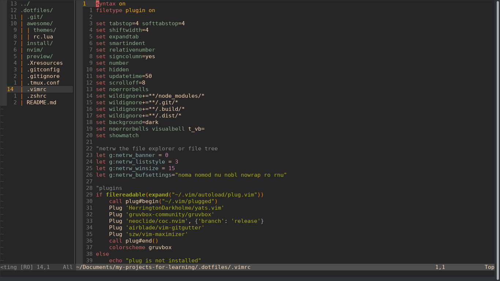

# Download

This is specific for **ubuntu**. If you are on some other operating system this will not work.

- Download zip file from this repo.
- Unzip file
  ```sh
  unzip -d ~/.dotfiles ./dotfiles.zip
  ```
- Open the terminal
- Run this command
  ```sh
  # In order to run "install.sh". you will need to change its permission first.
  chmod +x ./install/install.sh
  ./install/install.sh
  ```

## Preview


